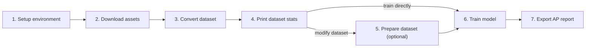

# YOLO Training Pipeline


A generic pipeline for converting raw detection datasets into YOLO format, inspecting YOLO-styled datasets, optionally mutating them with a recipe, training Ultralytics YOLO models, and exporting per-class AP reports.

---

**Navigation**
[`Home`](README.md) · [`Datasets`](docs/DATASETS.md) · [`Training`](docs/TRAINING.md) · [`CLI`](docs/CLI.md) · [`Architecture`](docs/ARCHITECTURE.md)

<table>
  <tr>
    <td><strong>💡 Tip</strong><br>The repository is organized around a strict order of stages. Read this page first, then follow the commands in the same order.</td>
  </tr>
</table>



## ✨ Pipeline Order

The intended pipeline is:

1. create an isolated environment
2. download model weights and raw dataset files
3. convert the raw dataset into a YOLO-styled dataset without changing its semantics
4. print statistics for the YOLO-styled dataset and decide what needs to change
5. optionally mutate the YOLO-styled dataset in place using a YAML recipe
6. train a YOLO model from config or CLI
7. collect weights and validation reports

This split is intentional:

- `core/` contains business logic
- `tools/` contains CLI only
- `scripts/` contains automation and demo shell flows

More detail: [Architecture](docs/ARCHITECTURE.md)

## 🧭 Documentation Map

| I want to... | Go here |
|---|---|
| understand the dataset flow | [Dataset Guide](docs/DATASETS.md) |
| see exact commands and flags | [CLI Reference](docs/CLI.md) |
| run training and analyze metrics | [Training Guide](docs/TRAINING.md) |
| understand the code layout | [Architecture](docs/ARCHITECTURE.md) |
| inspect the tracked NVIDIA preset | [`configs/train/nvidia.yaml`](configs/train/nvidia.yaml) |
| inspect the prepare recipe format | [`configs/prepare/yolo_dataset.yaml`](configs/prepare/yolo_dataset.yaml) |

## ✅ Public CLI Surface

Installable commands from `pyproject.toml`:

| Command | Purpose |
|---|---|
| `yolo-convert-dataset` | Convert raw annotations into a YOLO-styled dataset |
| `yolo-print-stats` | Print detailed stats for a YOLO-styled dataset |
| `yolo-prepare-dataset` | Mutate a YOLO-styled dataset in place using a YAML recipe |
| `yolo-train` | Launch Ultralytics training |
| `yolo-report-ap` | Export per-class AP metrics |

Supported raw input adapters today:

- `coco-detection`
- `per-image-json`

<table>
  <tr>
    <td><strong>📝 Note</strong><br>The pipeline is dataset-generic. Dataset-specific names such as Fashionpedia appear only in examples and demo scripts.</td>
  </tr>
</table>

## 📁 Project Layout

```text
.
├── configs/
│   ├── prepare/
│   │   └── yolo_dataset.yaml
│   └── train/
│       └── nvidia.yaml
├── core/
│   ├── common/
│   ├── datasets/
│   └── training/
├── docs/
│   ├── ARCHITECTURE.md
│   ├── CLI.md
│   ├── DATASETS.md
│   └── TRAINING.md
├── scripts/
│   ├── download_clothes_dataset.sh
│   ├── download_yolo_models.sh
│   └── setup_env.sh
├── tools/
│   ├── convert_dataset_to_yolo.py
│   ├── prepare_yolo_dataset.py
│   ├── print_yolo_dataset_stats.py
│   ├── report_ap.py
│   └── train.py
├── pyproject.toml
```

## 🚀 Quick Start

This is a full demo flow on `Fashionpedia`, from zero to the first training run.

### 1. Create the environment

Create a virtual environment isolated from the system Python and install project dependencies:

```bash
source scripts/setup_env.sh
```

What `setup_env.sh` does:

- creates `.venv`
- upgrades `pip`, `setuptools`, and `wheel` inside `.venv`
- installs the project from `pyproject.toml`
- activates `.venv` in the current shell
- exposes the `yolo-*` commands through editable install

Quick sanity check:

```bash
yolo-convert-dataset --help
yolo-print-stats --help
yolo-prepare-dataset --help
yolo-train --help
yolo-report-ap --help
```

<table>
  <tr>
    <td><strong>⚠️ Warning</strong><br>Run <code>source scripts/setup_env.sh</code>, not <code>bash scripts/setup_env.sh</code>, if you want the environment to stay active in the current shell.</td>
  </tr>
</table>

### 2. Download model weights and raw Fashionpedia data

Download a YOLO checkpoint that you want to fine-tune:

```bash
./scripts/download_yolo_models.sh --generation v26 --task detect --size n
```

Typical resulting path:

```text
models/YOLOv26/yolo26n.pt
```

Then download the demo dataset:

```bash
./scripts/download_clothes_dataset.sh --dataset fashionpedia
```

Expected raw layout:

```text
data/raw/fashionpedia/
├── train/
│   ├── annotations.json
│   └── images/
└── val/
    ├── annotations.json
    └── images/
```

Quick sanity check:

```bash
ls data/raw/fashionpedia/train
ls data/raw/fashionpedia/val
```

### 3. Convert Fashionpedia to YOLO format

This stage only converts the raw schema into a YOLO-styled dataset. It should not change class semantics or act as an optimizer stage.

```bash
yolo-convert-dataset \
  --dataset-name fashionpedia_demo \
  --input-format coco-detection \
  --train-images-dir data/raw/fashionpedia/train/images \
  --train-annotations data/raw/fashionpedia/train/annotations.json \
  --val-images-dir data/raw/fashionpedia/val/images \
  --val-annotations data/raw/fashionpedia/val/annotations.json \
  --output-root data/converted \
  --clean
```

Expected output:

```text
data/converted/fashionpedia_demo/
├── classes.txt
├── conversion_report_train.json
├── conversion_report_val.json
├── fashionpedia_demo.yaml
├── images/
└── labels/
```

Important point:

- after this step you already have a trainable YOLO-styled dataset
- if you do not need any class surgery or split changes, you can train directly on `fashionpedia_demo.yaml`

### 4. Print stats for the YOLO-styled dataset

This is the analysis step. Use it before touching the dataset.

```bash
yolo-print-stats --dataset-dir data/converted/fashionpedia_demo
```

What this prints:

- train / val image counts
- label file counts
- missing / orphan label counts
- empty label counts
- total instances
- mean bbox width / height / area
- mean bbox center position
- area bins for tiny / small / medium / large objects
- a per-class table with train / val / total counts

It also writes JSON by default:

```text
data/converted/fashionpedia_demo/dataset_stats.json
```

And it also writes two mosaic PNG reports:

```text
data/converted/fashionpedia_demo/dataset_stats_train.png
data/converted/fashionpedia_demo/dataset_stats_val.png
```

This is the report you should look at before deciding what to change in the next step.

### 5. Optionally prepare the YOLO-styled dataset in place

This step is optional. Use it only if you want to change the dataset itself.

Typical reasons:

- reduce `train` / `val` size
- drop classes
- rename classes
- merge several old classes into a new class name

Preparation is driven by a YAML recipe.

Start from the example recipe:

- [`configs/prepare/yolo_dataset.yaml`](configs/prepare/yolo_dataset.yaml)

Selector syntax in the recipe:

- exact class names, for example `"shirt, blouse"`
- numeric class ids, for example `23`
- id ranges, for example `"30-35"`

If a class name contains commas, quote it exactly as written in `classes.txt`.

Apply it like this:

```bash
yolo-prepare-dataset \
  --dataset-dir data/converted/fashionpedia_demo \
  --recipe configs/prepare/yolo_dataset.yaml
```

Important behavior:

- this step mutates the YOLO-styled dataset in place
- it does not create a second copy by default
- this saves disk space but is destructive
- if you need the original converted dataset back, rerun step 3

What gets updated in place:

- images removed by split sampling
- labels rewritten after class drops / remaps / merges
- `classes.txt`
- `<dataset>.yaml`
- `prepare_report.json`

Recommended follow-up after preparation:

```bash
yolo-print-stats --dataset-dir data/converted/fashionpedia_demo
```

### 6. Launch training

The tracked NVIDIA preset is here:

- [`configs/train/nvidia.yaml`](configs/train/nvidia.yaml)

At minimum, make sure these fields point to the dataset and checkpoint you want:

```yaml
model: models/YOLOv26/yolo26n.pt
data: data/converted/fashionpedia_demo/fashionpedia_demo.yaml
```

Then start training:

```bash
yolo-train --cfg configs/train/nvidia.yaml
```

Or override from CLI:

```bash
yolo-train \
  --cfg configs/train/nvidia.yaml \
  --model models/YOLOv26/yolo26n.pt \
  --data data/converted/fashionpedia_demo/fashionpedia_demo.yaml \
  --name fashionpedia-demo-run
```

Typical training outputs:

```text
runs/<name>/
├── args.yaml
├── results.csv
└── weights/
    ├── best.pt
    └── last.pt
```

### 7. Export per-class AP after training

After training, export validation metrics by class:

```bash
yolo-report-ap \
  --model runs/fashionpedia-demo-run/weights/best.pt \
  --data data/converted/fashionpedia_demo/fashionpedia_demo.yaml \
  --split val
```

Default output location:

```text
runs/analysis/
```

This gives you:

- CSV with one row per class
- JSON with global metrics and per-class values

### Command recap

```bash
source scripts/setup_env.sh

./scripts/download_yolo_models.sh --generation v26 --task detect --size n
./scripts/download_clothes_dataset.sh --dataset fashionpedia

yolo-convert-dataset \
  --dataset-name fashionpedia_demo \
  --input-format coco-detection \
  --train-images-dir data/raw/fashionpedia/train/images \
  --train-annotations data/raw/fashionpedia/train/annotations.json \
  --val-images-dir data/raw/fashionpedia/val/images \
  --val-annotations data/raw/fashionpedia/val/annotations.json \
  --clean

yolo-print-stats --dataset-dir data/converted/fashionpedia_demo

yolo-prepare-dataset \
  --dataset-dir data/converted/fashionpedia_demo \
  --recipe configs/prepare/yolo_dataset.yaml

yolo-print-stats --dataset-dir data/converted/fashionpedia_demo

yolo-train \
  --cfg configs/train/nvidia.yaml \
  --model models/YOLOv26/yolo26n.pt \
  --data data/converted/fashionpedia_demo/fashionpedia_demo.yaml \
  --name fashionpedia-demo-run

yolo-report-ap \
  --model runs/fashionpedia-demo-run/weights/best.pt \
  --data data/converted/fashionpedia_demo/fashionpedia_demo.yaml \
  --split val
```

## 🧩 Design Intent

The dataset pipeline has three distinct dataset-facing stages.

### Stage 3: conversion

`yolo-convert-dataset` absorbs raw schema differences and produces a clean YOLO-styled dataset.

It should not:

- drop classes for experimentation
- merge labels for task design
- act as a tuning stage

### Stage 4: stats

`yolo-print-stats` is the inspection stage.

Use it to answer questions like:

- which classes dominate?
- how many empty labels exist?
- how many tiny objects exist?
- how strong is the train/val imbalance?
- which classes should be merged or removed?

### Stage 5: preparation

`yolo-prepare-dataset` is the mutation stage.

It is optional because after conversion you already have a valid YOLO dataset.

Use it only when you intentionally want to change the dataset itself.

## 🛠️ Demo Scripts

`scripts/` is not the canonical pipeline interface.

Use it for:

- environment setup
- demo dataset download
- demo model download

The canonical pipeline interface is the installable CLI from `pyproject.toml`.

## 💡 Practical Advice

### Use stats before prepare

Do not merge or drop classes blindly.

The intended order is:

1. convert
2. print stats
3. decide changes
4. prepare
5. print stats again
6. train

### Treat `prepare` as destructive

Because `yolo-prepare-dataset` mutates the dataset in place, treat the converted dataset as a working copy.

If you want a pristine version again, rerun `yolo-convert-dataset`.

### Keep training config stable

Use YAML for stable defaults and CLI only for small temporary overrides.

---

**Next**
[`Dataset Guide`](docs/DATASETS.md) · [`CLI Reference`](docs/CLI.md) · [`Training Guide`](docs/TRAINING.md)
